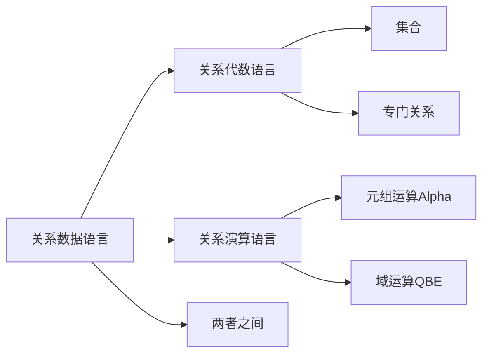
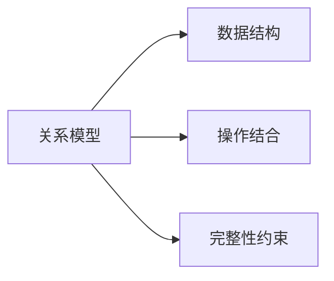

# Database

1.***UNION***:$R \cup S = \lbrace t | t \in R \vee t \in S \rbrace$

2.***EXCEPT***:$R \div S = R-S = \lbrace t| t \in R \wedge t \notin S\rbrace $

3.***INTERSECTION***:$R \cap S = \lbrace t | t \in R \wedge t \in S \rbrace$

4.***INTERSECTION***:$R \cap S = R - (R - S)$

5.***CARTESIAN PRODUCT***:$R \times S = \lbrace \widehat{t_r t_s}| t_r \in R \wedge t_s \in S \rbrace$

6.***IMAGES SET***:$Z_X = \lbrace t[Z] |t \in R , t[X] = x \rbrace$

7.***SELCET***:$\sigma_F(R) = \lbrace t|t \in R \wedge F(t) = '真' \rbrace$ F形式 $X_i \theta Y_i$:$\theta$比较运算符

8.***PROJECT***:$\Pi_i(R) = \lbrace t[A]|t \in R \rbrace$

9.***JOIN***:$R \bowtie_{A=B} S$

10.***NATURE JOIN***:$R \bowtie_{A=B} S$

## 关系数据语言结构

## 关系模型

